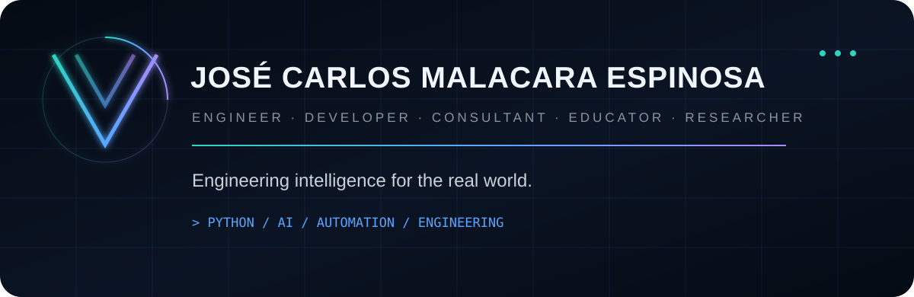
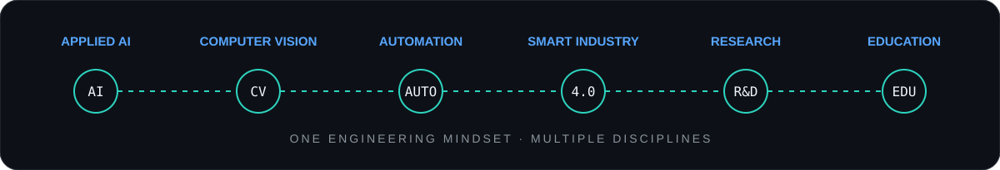
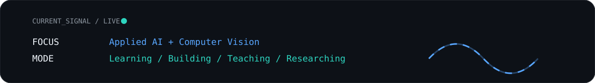

 

## `01 // PROFILE`

I work where **software meets engineering**. I enjoy turning difficult technical problems into practical systems through Python, artificial intelligence, automation and data.

My background in **Mechatronics** shapes the way I approach software: understand the system, model the problem, build deliberately, test relentlessly and keep improving.

### `Technology should not only be intelligent — it should be useful.`

## `02 // ENGINEERING DNA`

My interests are deliberately interdisciplinary. I am especially drawn to technologies that **augment human capabilities**, improve industrial or scientific processes, and turn information into better decisions.

## `03 // TECHNOLOGY`

  

`Python` · `NumPy` · `Pandas` · `PyTorch` · `YOLO` · `OpenCV` · `Scikit-learn` · `ONNX`  
`SQL` · `Git` · `Linux` · `Streamlit` · `Flask` · `Data Analysis` · `Machine Learning`

## `04 // CURRENT SIGNAL`

- 🔬 Exploring **Applied AI and Computer Vision**
- 🏭 Connecting software with **engineering and intelligent manufacturing**
- 🎓 Teaching, mentoring and learning through **engineering education**
- 🧠 Interested in difficult problems, useful systems and anything that **sparks curiosity**

## `05 // GITHUB ACTIVITY`

 

Activity is shown here as a signal of consistency. The repositories below remain the place to explore the actual work.

## `06 // BEYOND SOFTWARE`

Technology is only one part of what I do. I also care deeply about **engineering education, technical mentoring, applied research, problem solving and continuous learning**.

I enjoy learning difficult things. Whether the problem lives in software, artificial intelligence, automation, manufacturing or research, I believe **curiosity and discipline are among the most valuable tools an engineer can have**.

### `Never Stop Learning. Never Stop Building.`

